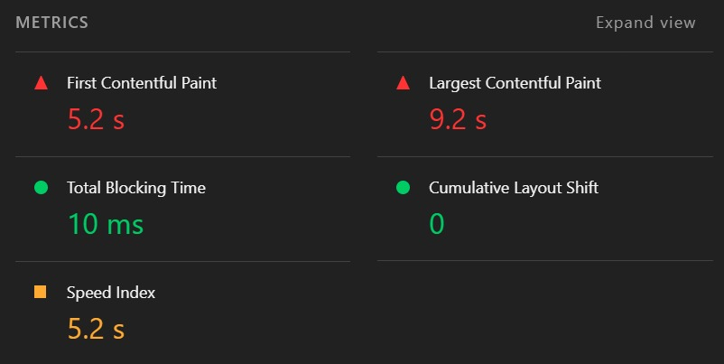
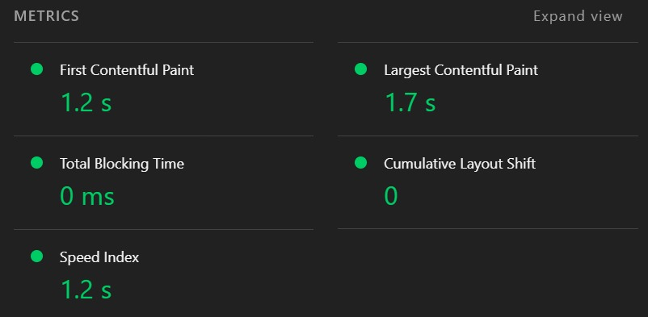

# Catálogo de Produtos (React + Vite) — Otimização de Performance

## Descrição

Aplicação front-end em React para exibir um catálogo de produtos, com formulário controlado para adicionar novos itens e carregamento simulado com `useEffect`.

## Como rodar o projeto

```bash
npm install
npm run dev
```

Para medir performance (produção):

```bash
npm run build
npm run preview
```

## Análise inicial (Lighthouse)

Medições realizadas no Lighthouse (Chrome DevTools) em **modo Mobile**.

### Resultados ANTES

* Performance: **66**
* LCP: **9.2s**
* CLS: **0**
* TBT: **10ms**

**Print do relatório (antes):**


## Gargalos identificados

* Imagens com carregamento e prioridade não otimizados (impacto direto no **LCP**)
* Requisições/recursos não ideais para carregamento inicial no mobile
* Ajustes de renderização necessários para melhorar estabilidade visual (**CLS**)

## Melhorias aplicadas

* Imagens locais no projeto (reduz dependência externa e melhora previsibilidade)
* Aplicado `loading="lazy"` para imagens fora da área inicial e prioridade (`eager` / `fetchpriority="high"`) para a primeira imagem (melhora LCP)
* Definido `width` e `height` nas imagens para reduzir **CLS**
* Build de produção com minificação via Vite (`npm run build`)
* Remoção de trechos não utilizados (imports/estilos quando aplicável)

## Reanálise e comparação

### Resultados DEPOIS

* Performance: **100**
* LCP: **1.7s**
* CLS: **0**
* TBT: **0ms**

**Print do relatório (depois):**


## Comentários (maior impacto)

As melhorias com maior impacto foram a otimização do carregamento das imagens (prioridade no primeiro conteúdo visível e lazy-load no restante) e a definição de dimensões para reduzir layout shift, resultando em melhoria significativa no LCP e maior estabilidade no mobile.
